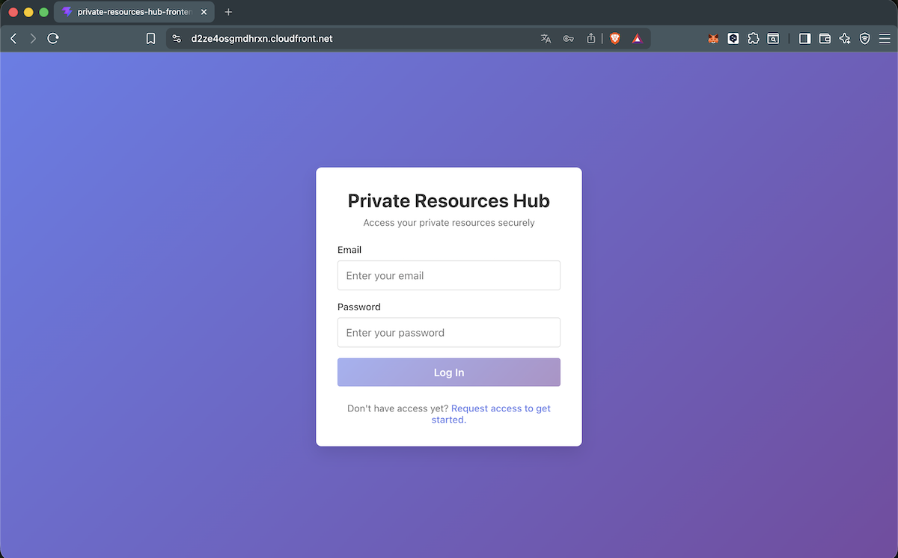
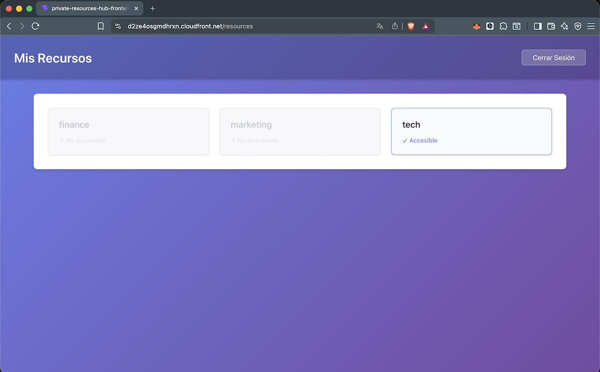
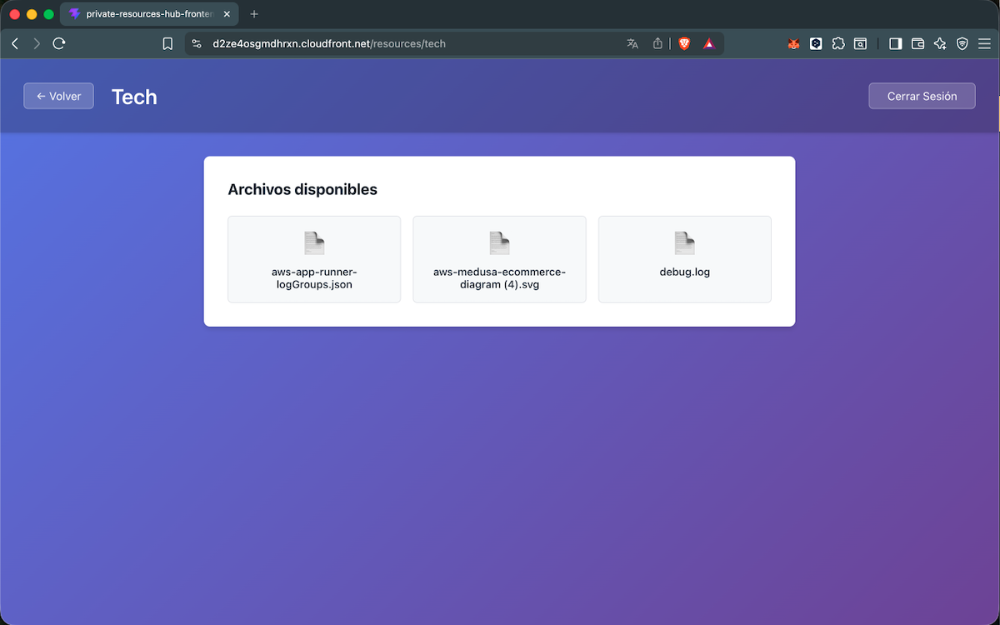

# Private Resources Hub - Frontend

A secure, production-ready React + TypeScript + Vite single-page application (SPA) for accessing private resources through Amazon Cognito authentication and AWS integration.

---

## Overview

**Private Resources Hub** is a frontend application that enables authenticated users to securely access private resources hosted on AWS. The application integrates with Amazon Cognito User Pools for authentication and works seamlessly with an AWS backend infrastructure to provide role-based access control to protected content distributed through Amazon CloudFront.

### Key Features

- **Secure Authentication**: Email and password login via Amazon Cognito User Pool
- **Role-Based Access Control**: Display resources based on user permissions determined by the backend
- **CloudFront Signed Cookies**: Automatic handling of signed cookies for secure content delivery
- **Protected Routes**: Automatic redirection of unauthenticated users to the login page
- **Responsive UI**: Clean and minimal interface optimized for modern browsers
- **Type-Safe Development**: Full TypeScript support with explicit type definitions

---

## Application Architecture

The application is built on a client-side SPA architecture that communicates with AWS backend services:

```
┌─────────────────────┐
│  React Vite SPA     │  (This frontend)
│  S3 + CloudFront    │
└──────────┬──────────┘
           │
           │ API Calls (JWT Auth)
           │
┌──────────▼──────────┐
│  API Gateway        │
│  + Lambda           │
└──────────┬──────────┘
           │
┌──────────┼──────────┐
│          │          │
│     DynamoDB   Cognito
│     (Perms)    (Auth)
│
└──────────┬──────────┐
           │
    ┌──────▼──────┐
    │  S3 Private │
    │  + CloudFront
    │  (Content)
    └─────────────┘
```

---

## Application Components

### Pages

#### 1. **Login Page** (`/`)
The entry point of the application where users authenticate with their email and password.

- Email input field with validation
- Password input field
- Login button with loading state
- Error message display for authentication failures
- Link to request access for new users

#### 2. **Resources Page** (`/resources`)
Protected page displaying all available resource directories for the authenticated user.

- List of resource directories with access status
- Accessible resources displayed as clickable links
- Inaccessible resources displayed as disabled items
- Loading and error states
- Logout button

#### 3. **Directory Page** (`/resources/:directoryName`)
Protected page showing the contents of a specific resource directory.

- Automatic permission validation before content display
- List of files available in the selected directory
- Direct download links to files
- Back navigation to resources list
- Permission error handling (403 Forbidden)

### Core Modules

#### `api/` - API Client
- `client.ts` - Base HTTP client with JWT token handling
- `resources.ts` - Resource-specific API calls
- `index.ts` - Public API exports

#### `auth/` - Authentication
- `cognito.ts` - Amazon Cognito configuration and initialization
- `auth.ts` - Authentication logic and token management
- `AuthProvider.tsx` - React context provider for auth state

#### `components/` - Reusable UI Components
- `ProtectedRoute.tsx` - Route guard ensuring only authenticated users can access protected pages
- `ResourceCard.tsx` - Component for displaying individual resource items

#### `pages/` - Route Components
- `LoginPage.tsx` - Login form and authentication
- `ResourcesPage.tsx` - Resource directory listing
- `DirectoryPage.tsx` - Directory content and file listing

#### `types/` - TypeScript Definitions
- `api.ts` - API response and request type definitions

#### `styles/` - Styling
- Component-specific CSS modules for maintainability

#### `hooks/` - Custom React Hooks
- `useAuth.ts` - Hook for accessing authentication context

---

## Navigation Flow

### User Journey

```
1. User visits application
   └─ Not authenticated
      └─ Redirect to Login Page (/)
      
2. Login Page (/)
   ├─ Enter email and password
   ├─ Click "Log In"
   ├─ Cognito validates credentials
   └─ If successful → Navigate to Resources Page
   
3. Resources Page (/resources)
   ├─ Display list of directories
   ├─ Each resource shows:
   │  ├─ Name
   │  └─ Access status (Accessible / No disponible)
   ├─ Click accessible resource
   └─ Navigate to Directory Page (/resources/{directoryName})
   
4. Directory Page (/resources/{directoryName})
   ├─ Request access via POST /resources/{directoryName}/access
   ├─ Backend validates JWT and checks DynamoDB permissions
   ├─ Backend sets CloudFront signed cookies
   ├─ Fetch file list via GET /resources/{directoryName}
   ├─ Display files as downloadable links
   └─ User can:
      ├─ Download files (via signed CloudFront URLs)
      └─ Return to Resources Page (back button)

5. Logout
   └─ Clear authentication tokens
   └─ Redirect to Login Page (/)
```

### UI Screenshots

#### Login Page
Users authenticate with their Cognito credentials on this clean login form.



#### Resources Page
After login, users see their available resources. Some resources may be restricted based on permissions.



#### Directory Page
When accessing an authorized directory, users can view and download files.



---

## Technology Stack

- **React 19+** - UI framework
- **TypeScript 5+** - Type-safe JavaScript
- **Vite 5+** - Lightning-fast build tool
- **React Router 7+** - Client-side routing
- **AWS Amplify Auth** / **amazon-cognito-identity-js** - Cognito authentication
- **Native Fetch API** - HTTP requests (no heavy dependencies)
- **CSS Modules** - Component-scoped styling

---

## Security Considerations

✅ **What we do right:**
- JWT tokens sent via `Authorization` header (never in URLs)
- Tokens stored securely (memory or sessionStorage, not localStorage)
- Protected routes prevent unauthorized access to pages
- All authorization decisions validated by the backend
- CloudFront signed cookies handled by backend only
- No AWS credentials exposed in frontend code

⚠️ **What the backend handles:**
- JWT validation and token refresh
- DynamoDB permission checks
- CloudFront signed cookie generation
- Access control decisions
- Rate limiting and security headers

---

## Notes
This is a personal project whose goal is to check the correct functioning of the underlying AWS infrastructure. That is the reason why it does not include a sign-up page.
